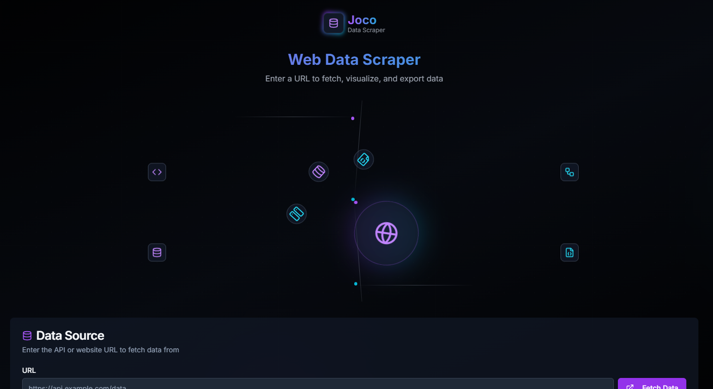

# Next.js Project

This is a modern web application built with Next.js, TypeScript, and Tailwind CSS.

## Thumbnail



## Technologies Used

- [Next.js](https://nextjs.org/) - React framework for production
- [TypeScript](https://www.typescriptlang.org/) - Type-safe JavaScript
- [Tailwind CSS](https://tailwindcss.com/) - Utility-first CSS framework
- [PNPM](https://pnpm.io/) - Fast, disk space efficient package manager

## Getting Started

### Prerequisites

- Node.js (version 16.x or higher)
- PNPM package manager

### Installation

1. Clone the repository:
```bash
git clone [your-repository-url]
```

2. Install dependencies:
```bash
pnpm install
```

3. Start the development server:
```bash
pnpm dev
```

The application will be available at [http://localhost:3000](http://localhost:3000).

### Build

To build the application for production:

```bash
pnpm build
```

To start the production server:

```bash
pnpm start
```

## Project Structure

```
├── app/                # Next.js app directory (pages and layouts)
├── components/         # Reusable React components
├── hooks/             # Custom React hooks
├── lib/               # Utility functions and shared logic
├── public/            # Static assets
├── styles/            # Global styles and Tailwind CSS configuration
├── tsconfig.json      # TypeScript configuration
├── tailwind.config.ts # Tailwind CSS configuration
└── next.config.mjs    # Next.js configuration
```

## Development

- The project uses the Next.js App Router for routing
- Styling is done using Tailwind CSS
- TypeScript is used for type safety
- Components are organized in the `components/` directory
- Custom hooks are stored in the `hooks/` directory
- Utility functions are kept in the `lib/` directory

## License

[Add your license information here]

## Contributing

[Add contribution guidelines here] 